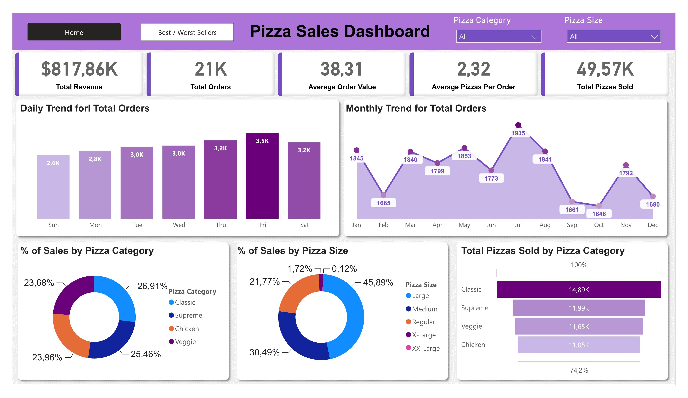
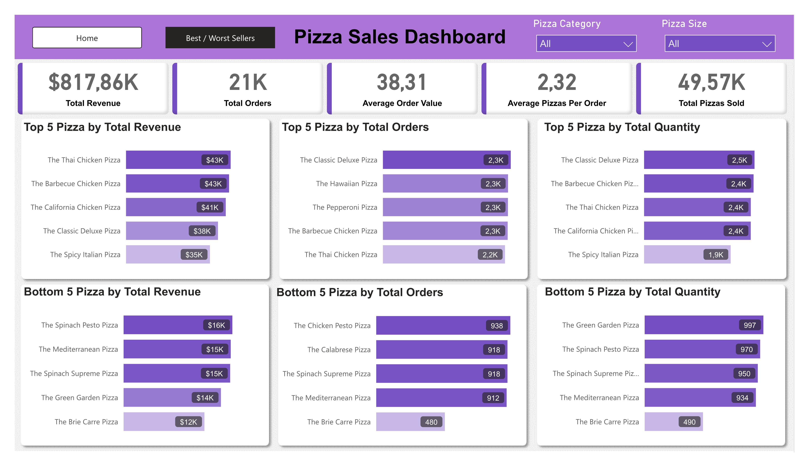

# Tableaux de Bord des Ventes de Pizza

## Description du Projet

Ce projet consiste à analyser les données des ventes de pizza, en fournissant des indicateurs clés et des visualisations pour prendre des décisions.

## Jeu de Données

**pizza_sales.csv** : ce fichier contient les détails des ventes

## Méthodologie

### 1. Nettoyage et Transformation des données
On utilise Power Query pour importer, nettoyer et transformer les données.

### 2. Modélisation des Données
On établie des relations entre les différentes tables puis on crée des mesures DAX pour l'analyse.

Tables :

- Sales
- Calendar

### 3. KPI

- **Chiffre d'affaires**

- **Quantité moyenne des commandes**

- **Quantité totale de pizza vendues**

- **Quantité totale des commandes**

- **Quantité moyenne de pizza par commande**

### 4. Visualisation et Rapport

1 - **Tendance journalière de quantité des commandes :** 

On crée un diagramme en barres qui affiche la tendance journalière de la quantité des commandes. 
Ce graphique nous aidera à identifier les fluctuations dans les volumes de commandes quotidiens.

2 - **Tendance mensuelle de quantité des commandes :** 

On crée un graphique de tendance qui illustre la tendance mensuelle de la quantité des commandes.

3 - **Pourcentage des ventes par catégorie :** 

On crée un diagramme en camembert qui montre la répartition des ventes entre les différentes catégories de pizza. Ce graphique fournira des informations sur la popularité des différentes catégories de pizza et leur contribution aux ventes totales.

4 - **Pourcentage des ventes par taille :** 

On crée un diagramme en camembert qui représente les pourcentages des ventes attribuées aux différentes tailles de pizza. Ce graphique nous aidera à comprendre les préférences des clients en matière de tailles de pizza et leur impact sur les ventes.

5 - **Quantité vendue par catégorie :** 

On crée un diagramme en entonnoir qui présente le nombre total de pizza vendues pour chaque catégorie de pizza. 
Ce graphique nous permettra de comparer la performance des ventes entre les différentes catégories de pizza.

6 - **Les 5 meilleurs pizzas en termes de chiffre d'affaires, de quantité vendue et de nombre des commandes :**

On crée un diagramme en barres mettant en évidence les 5 meilleures ventes basées sur le chiffre d'affaires, la quantité totale vendue et le nombre total de commandes. Ce graphique nous aidera à identifier les options de pizza les plus populaires.

7 - **Les 5 pizzas les moins performantes en termes de chiffre d'affaires, de quantité vendue et de nombre des commandes :** 

On crée un diagramme en barres présentant les 5 pires ventes de pizzas basées sur le chiffre d'affaires, la quantité totale vendue et le nombre total de commandes. Ce graphique nous permettra d'identifier les options de pizza moins populaires.
s
## Outils et Technologies utilisées :

-	Power BI
-	Power Query
-	DAX

## Screenshots :

